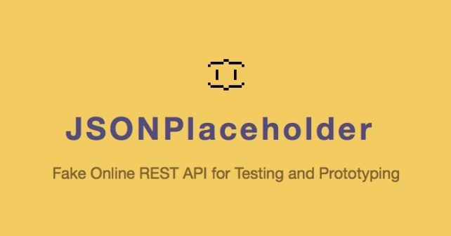

# RestApiTesting.Framework.Jaguar  
This is a RESTful API testing Framework using C#, .NET Core, xUnit, Specflow BDD with context injection, Flurl and Fluent Assertions to test JSONPlaceholder REST API.  

## Specflow  
Use SpecFlow to define, manage and automatically execute human-readable acceptance tests in .NET projects. Writing easily understandable tests is a cornerstone of the BDD paradigm and also helps build up a living documentation of your system. https://specflow.org/
### Context Injection
SpecFlow supports a very simple dependency framework that is able to instantiate and inject class instances for the scenarios. With this feature you can group the shared state to context-classes, and inject them into every binding class that is interested in that shared state. https://specflow.org/documentation/Context-Injection/

## Target framework  
.NET Core 2.1

## JSONPlaceholder  
JSONPlaceholder is a free online REST API that you can use whenever you need some fake data. It's great for tutorials, testing new libraries, sharing code examples.
https://jsonplaceholder.typicode.com/

## Routes Tested
The following HTTP methods are tested:
* GET
* POST
* PUT
* PATCH
* DELETE

## Flurl  
Flurl is a modern, fluent, asynchronous, testable, portable, buzzword-laden URL builder and HTTP client library for .NET. https://flurl.dev/
### Fluent HTTP
Flurl allows you to perform many common HTTP tasks directly off the fluent URL builder chain. Barely under the hood is HttpClient and related classes. As you'll see, Flurl enhances HttpClient with convenience methods and fluent goodness but doesn't try to abstract it away completely.
https://flurl.dev/docs/fluent-http/

## Assertions 
Fluent Assertions is used for validation.
https://fluentassertions.com/ 

## Integrated Development Environment
Microsoft Visual Studio IDE is used to develop this Framework.

### Visual Studio Extensions
* Extensions => Manage Extensions => Search and Install SpecFlow for Visual Studio

### Build Solution
* Build => Build Solution

### Run Tests
* Test => Windows => Test Explorer => Run All

### Run Tests with Command Prompt/Windows PowerShell
* Open Folder in File Explorer: ..\RestApiTesting.Framework.Jaguar\bin\Debug\netcoreapp2.1
* Open Command Prompt/Windows PowerShell
* Run "dotnet vstest RestApiTesting.Framework.Jaguar.dll"
